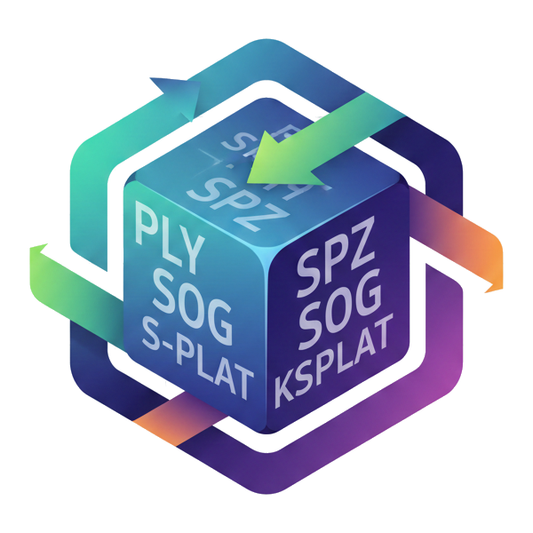

# GaussForge

<div align="center">
  
</div>

A high-performance Gaussian Splatting format conversion library that supports lossless conversion between multiple mainstream formats.

## Online Viewer

Try GaussForge in your browser! Visit **[3DGS Viewer](https://www.3dgsviewers.com/)** - a free online 3D Gaussian Splatting viewer that supports multiple formats including PLY, SPZ, SPLAT, KSPLAT, and SOG. The viewer integrates GaussForge, allowing you to view and export models in all supported formats directly in your web browser. No installation required - simply upload your 3DGS model file and start viewing instantly.

## Features

- **Multi-format Support**: Supports PLY, compressed.ply, SPLAT, KSPLAT, SPZ and other formats
- **High Performance**: Written in C++17 with deep performance optimizations
- **Lossless Conversion**: Based on a unified intermediate representation (IR) to ensure data integrity
- **Easy Integration**: Provides both static library and command-line tool
- **WebAssembly Support**: WASM build available for browser and Node.js environments with TypeScript bindings
- **Data Validation**: Built-in data validation mechanism to ensure conversion quality
- **Zero Dependencies**: Only depends on necessary third-party libraries (managed via CMake FetchContent), apart from build tools

## Supported Formats

| Format | Extension | Read | Write | Description |
|--------|-----------|------|-------|-------------|
| PLY | `.ply` | ✅ | ✅ | Standard PLY format |
| SPZ | `.spz` | ✅ | ✅ | SPZ compressed format |
| Compressed PLY | `.compressed.ply` | ✅ | ✅ | Compressed PLY format |
| SPLAT | `.splat` | ✅ | ✅ | Splat format |
| KSPLAT | `.ksplat` | ✅ | ✅ | K-Splat format |
| SOG | `.sog` | ⏳ | ⏳ | SOG format (not yet implemented) |
| LCC | `.lcc` | ⏳ | ⏳ | LCC format (not yet implemented) |

## Quick Start

### System Requirements

- CMake 3.26 or higher
- C++17 compatible compiler (GCC 7+, Clang 5+, MSVC 2017+)
- Build tools: Ninja or Make

### Building the Project

```bash
# Create build directory
mkdir build && cd build

# Configure build (Debug mode)
cmake ..

# Or configure Release mode (with optimizations enabled)
cmake -DCMAKE_BUILD_TYPE=Release ..

# Build
cmake --build .

# Run tests (optional)
ctest
```

### Installation

```bash
# In the build directory
cmake --install . --prefix /usr/local
```

## Usage

### Command-Line Tool

The project provides the `gfconvert` command-line tool for converting Gaussian splat files between different formats:

```bash
# Basic usage
./gfconvert <input_file> <output_file>

# Example: Convert PLY to SPZ
./gfconvert input.ply output.spz

# Example: Convert compressed.ply to standard PLY
./gfconvert input.compressed.ply output.ply

# Manually specify formats (when file extensions are non-standard)
./gfconvert input.dat output.dat --in-format ply --out-format spz
```

### Using as a Library

GaussForge can be integrated into your project as a static library:

```cpp
#include "gf/core/gauss_ir.h"
#include "gf/io/registry.h"
#include "gf/io/reader.h"
#include "gf/io/writer.h"

// Create registry (automatically registers all built-in formats)
gf::IORegistry registry;

// Get reader and writer
auto* reader = registry.ReaderForExt("ply");
auto* writer = registry.WriterForExt("spz");

// Read file
gf::ReadOptions read_opt;
auto ir = reader->Read(data, size, read_opt);

// Write file
gf::WriteOptions write_opt;
auto out_data = writer->Write(ir.value(), write_opt);
```

### WebAssembly (WASM) Support

GaussForge also provides a WebAssembly build that enables format conversion directly in web browsers and Node.js. The WASM version includes a TypeScript wrapper library for easy integration into frontend applications.

**Installation:**
```bash
npm install @gaussforge/wasm
```

**Quick Example:**
```typescript
import { createGaussForge } from '@gaussforge/wasm';

const gaussForge = await createGaussForge();
const converted = await gaussForge.convert(fileData, 'ply', 'spz');
```

For detailed WASM usage and API documentation, see the [WASM README](wasm/README.md).

## Project Structure

```
GaussForge/
├── include/           # Header files
│   └── gf/
│       ├── core/      # Core data structures (IR, metadata, validation)
│       └── io/        # I/O interfaces and format implementations
├── src/               # Source files
│   ├── core/          # Core implementations
│   ├── io/            # I/O implementations
│   └── cli/           # Command-line tool
└── cmakes/            # CMake configuration files
```

## Core Concepts

### Intermediate Representation (IR)

GaussForge uses a unified intermediate representation `GaussianCloudIR` to store Gaussian splat data:

- **Positions**: 3D coordinate array
- **Scales**: Logarithmic scale values
- **Rotations**: Quaternion-represented rotations
- **Alphas**: Pre-sigmoid opacity values
- **Colors**: Spherical harmonics 0th-order (DC) coefficients
- **SH Coefficients**: Higher-order spherical harmonics coefficients
- **Metadata**: Coordinate system, units, color space, and other information

### Data Validation

Basic data validation is automatically performed during conversion to ensure:
- Array size consistency
- Data range reasonableness
- Format specification compliance

## Development

### Adding New Format Support

1. Create new reader/writer header files in `include/gf/io/`
2. Implement corresponding reader/writer in `src/io/`
3. Register the new format in `src/io/registry.cpp`

### Build Options

- `CMAKE_BUILD_TYPE=Debug`: Debug mode with debug information
- `CMAKE_BUILD_TYPE=Release`: Release mode with all optimization options enabled (-O3, LTO, vectorization, etc.)

## License

This project is licensed under the [Apache License 2.0](LICENSE). See the [LICENSE](LICENSE) file for details.

## Contributing

Contributions via Issues and Pull Requests are welcome!

## Related Resources

- [3D Gaussian Splatting Paper](https://repo-sam.inria.fr/fungraph/3d-gaussian-splatting/)
- [SPZ Format Documentation](https://github.com/nianticlabs/spz)

## Acknowledgments

Thanks to all developers who have contributed to the standardization of Gaussian splat formats.

